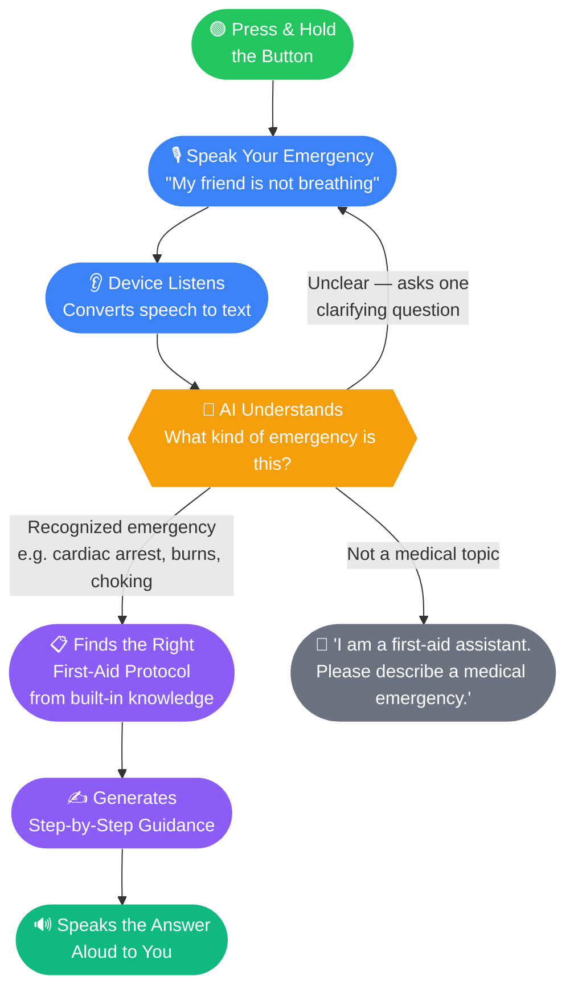
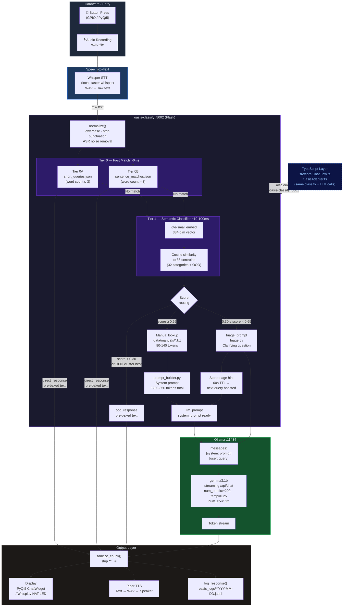

# O.A.S.I.S. System Flowcharts

---

## 1. For General Users & Investors

How O.A.S.I.S. turns a spoken emergency question into step-by-step spoken guidance — **entirely offline**.

### Key Points for Investors

| | |
|---|---|
| **Fully offline** | No internet required. Works in wilderness, disaster zones, power outages. |
| **< 3 second response** | Optimized for Raspberry Pi 5 — from button press to first spoken word. |
| **32 emergency categories** | CPR, choking, bleeding, burns, allergic reactions, mental health crises, and more. |
| **Voice in, voice out** | No screen or typing needed — works with gloves, in darkness, under stress. |

---

## 2. For Developers

Full technical pipeline — from button press to TTS output.

### Component Map

| Component | File | Port | Language |
|---|---|---|---|
| PyQt5 GUI | `python/oasis-gui/main.py` | — | Python |
| Pipeline orchestration | `python/oasis-gui/core/pipeline_worker.py` | — | Python |
| Classify service | `python/oasis-classify/service.py` | :5002 | Python / Flask |
| Tier 0 fast match | `python/oasis-classify/fast_match.py` | — | Python |
| Tier 1 classifier | `python/oasis-classify/classifier.py` | — | Python (gte-small) |
| Prompt assembly | `python/oasis-classify/prompt_builder.py` | — | Python |
| TypeScript orchestrator | `src/core/ChatFlow.ts` | — | TypeScript |
| TypeScript adapter | `src/core/OasisAdapter.ts` | — | TypeScript |
| Classify HTTP client (TS) | `src/cloud-api/local/oasis-classify-client.ts` | — | TypeScript |
| Classify HTTP client (Py) | `python/oasis-gui/clients/classify_client.py` | — | Python |
| LLM HTTP client (Py) | `python/oasis-gui/clients/llm_client.py` | :11434 | Python |

### Dispatch Mode Decision Table

| Score | Path | Mode | LLM called? |
|---|---|---|---|
| Tier 0 match | `tier0_short` / `tier0_sentence` | `direct_response` | No |
| < 0.30 or OOD cluster | `ood_floor` / `ood_cluster` | `ood_response` | No |
| 0.30 – 0.65 | `triage` | `triage_prompt` | Yes — asks clarifying Q |
| ≥ 0.65 | `classifier_hit` | `llm_prompt` | Yes — step-by-step answer |
